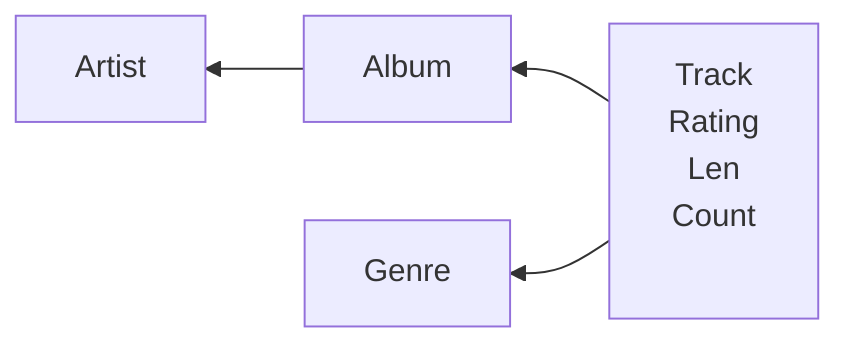

### Database Design
- Database design is an art form of its own with particular skills and experience.
- Our goal is to avoid the really bad mistakes and design clean and easily understood databases.
- Others may performance tune things later.
- Database design starts with a picture...
![[Pasted image 20230905153344.png|600|center]]
### Building a Data Model
- Drawing a picture of the date objects for our application and then figuring out how to represent the objects and their relationships 
- Basic Rule: Don't put the same string data in twice - use a relationship instead
- When there is one thing in the "real world" there should only be one copy of that thing in the database
- Information that repeats a lot should be in its own table. 
### Example
![[Pasted image 20230905155209.png]]
#### For each "piece of info"
- Is the column an object or an attribute of another object?
- Once we define objects we need to define relationships between objects.
- Now we make a table for every field with string duplication. We do not need to worry about integer duplication
- Each arrow represent that something belongs to it

